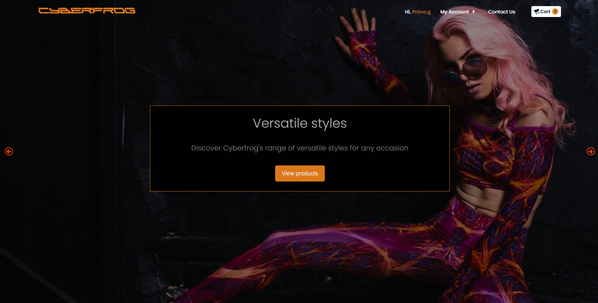

# Cyber Frog E-commerce

> **A full-stack clothing store built with React, Firebase, and Stripe. Originally developed as a university group project.**

[View Demo](https://emanuele-sgroi.github.io/CyberFrog-ecommerce-project/)



To see more of the front end please visit the [project website](https://emanuele-sgroi.github.io/CyberFrog-ecommerce-project/) or [my portfolio](https://www.emanuelesgroi.com/portfolio/cyber-frog-e-commerce)

## Table of Contents

- [Overview](#overview)
- [Core Features](#core-features)
- [How It Works](#how-it-works)
- [Why This Project?](#why-this-project)
- [How to Use](#how-to-use)
- [Conclusion](#conclusion)
- [License](#license)
- [Contact](#contact)
- [Acknowledgments](#acknowledgments)

---

## Overview

Cyber Frog is a full-stack e-commerce application built as part of a university group project. Users can browse products, register or log in, manage a cart, and complete secure payments using Stripe. Admins have access to a dashboard for managing products, viewing revenue, and updating order statuses. While I didn’t handle the design, I led development across both front end and back end, integrating authentication, payments, state management, and database logic.

---

## Core Features

1. **Authentication**

   - Sign up, login, logout, and password reset using Firebase Auth..
   - Supports both email/password and Google sign-in.

2. **Product Filtering & Cart Management**

   - Users can filter by category, add items to the cart, adjust quantity and size, and view cart totals in real time.

3. **Stripe Payments**

   - Stripe integration through a custom Express backend.
   - Users can securely check out, and their order is confirmed on success.

4. **Order History & Status Tracking**

   - Users can view their full order history and order statuses.
   - Order data is stored in Firestore and includes time, amount, and product details.

5. **Admin Panel**

   - Admins can add, edit, or remove products.
   - Order statuses can be updated (e.g. from “Processing” to “Shipped”).
   - A dashboard view displays total revenue and current order count.

6. **Email Confirmation**

   - On successful purchase, users receive a confirmation email via EmailJS.

7. **Responsive Layout**
   - Separate navigation and layout for mobile and desktop views.

---

## How It Works

- **State Management**
  Redux Toolkit handles global state across authentication, cart, checkout, orders, and filters.

- **Authentication & Database**
  Firebase handles user login and registration, while Firestore stores user data, products, orders, and reviews.

- **Stripe Checkout**
  Stripe’s payment flow is handled via an Express backend deployed on Render, with client secret securely retrieved on checkout.

- **Order Processing**
  After payment, the order is saved in Firestore and a confirmation email is sent automatically to the user.

- **Admin Tools**
  Admins can access a dashboard to view earnings, manage inventory, and update orders.

---

## Why This Project?

This was a group assignment for a university course, but I led development and built most of the application myself. My goal was to go beyond a simple CRUD system and implement a complete e-commerce experience, from product listings to real payment flows. It also gave me the chance to integrate multiple technologies like Firebase, Stripe, and Express, and manage full-stack architecture in a production-style setup.

---

## How to Use

1. **Clone the repository**

   ```
   git clone https://github.com/Emanuele-Sgroi/CyberFrog-ecommerce-project
   cd CyberFrog-ecommerce-project
   ```

2. **Install Dependencies**

```
npm install
```

3. **Run the Frontend and Backend**

```
npm run start:frontend
npm run start:backend

```

4. **Environment Setup**  
   Create a .env file with the following variables:

```
STRIPE_PRIVATE_KEY=XXXXXXXXXXXX
REACT_APP_STRIPE_PK=XXXXXXXXXXXX
REACT_APP_ADMIN_USER=youradminemail@gmail.com
REACT_APP_FB_API_KEY=XXXXXXXXXXXX
REACT_APP_EMAILJS_SERVICE_ID=XXXXXXXXXXXX
REACT_APP_PUBLIC_URL=your public domain or localhost
REACT_APP_BACKEND_URL=your backend erl or port 8080 (or different one)
NODE_ENV="production" ## or development'

```

5. **Firebase & Stripe Setup**

- Set up Firebase project and Firestore collections for users, products, and orders. Connect a test Stripe account and enable test mode payments.

---

## Conclusion

This approach seamlessly balances a luxury aesthetic with the simplicity needed for rapid duplication. By employing Next.js, Tailwind, and Contentful, real estate agents can deploy new, polished property sites in minutes, complete with inquiry handling and CRM integration. It’s a fast, scalable solution for showcasing any high-end apartment or condo.

---

## License

Cyber Frog is a complete e-commerce simulation with real authentication, payments, state management, and admin functionality. It was built to mimic a real-world store, going beyond academic requirements to include a working Stripe flow and full CRUD capabilities. It served as a solid foundation for understanding full-stack development in practice.

---

## Contact

You can contact me here:

- **Email**: em.sgroi@gmail.com
- **Website**: [emanuelesgroi.com](https://www.emanuelesgroi.com)

## Acknowledgments

Special thanks to the members of my team:

- Tommaso Bacci
- Noemi Baglieri
- Anca Craciunca
